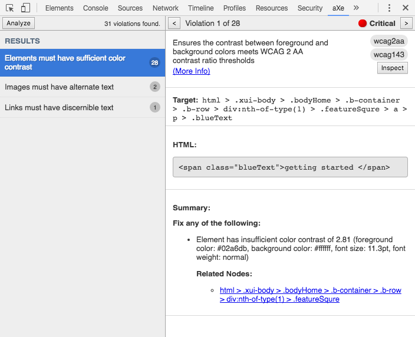

##FIND AN ACCESSIBILITY BUG

For todays task I used a tool I'd never used before to perform some ACCESSIBILITY analysis on a site I'd not checked before. Easy pickings really :)

I opted for a chrome plugin called: [Axe](https://chrome.google.com/webstore/detail/axe/lhdoppojpmngadmnindnejefpokejbdd)

In a previous role I was an Accessibility champion for MSN's european news platform. One of the most common issues I used to encounter back then was the issue of color contrast. As the web tried in earnest to be a visually fun place to be, the accessibility of those same sites diminished as gradients, etc became popular. This is a hard line to sell, understandably designers could feel like creative direction is being stifled by limitations imposed on them via the [WCAGS](https://www.w3.org/TR/WCAG20/) standards.

In my opinion 95% of the web can be described as global infrastructure, where the intent is to connect people with services or information. There may be 5% that is so creative it tends towards being classified as "art". You're website isn't the masterpiece you think it is, it's a pathway to information or a service you wish to share/sell, and any impediment to accessibility diminishes your ability to do that.

The website I tested today had 28 contrast violations on the first page I checked. 

These are 28 instances of a visual cue being potentially invisible to someone with diminished visual capability. I'm not talking about  someone who is medically classified as blind, I'm talking about people with less than perfect eyesight, not being able to do what they need to, because the page they are using is not perceivable. You can read more on the four principles of accessibility [here](https://www.w3.org/TR/UNDERSTANDING-WCAG20/intro.html)  

I've raised the issue with the appropriate team. I'm hoping they can see that the value in fixing this outweights the cost of implementing a fix.
